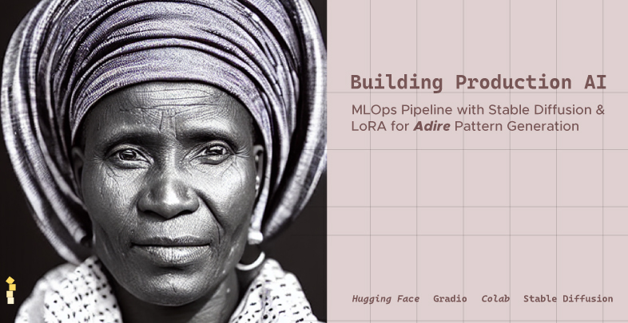
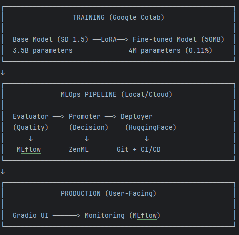
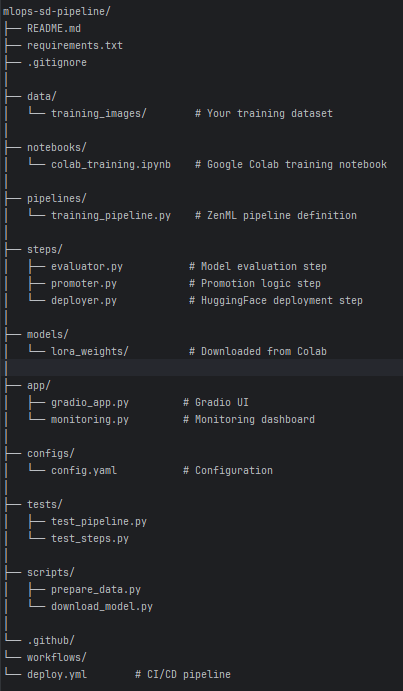
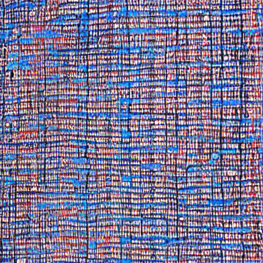

# Production MLOps: Stable Diffusion Fine-Tuning Pipeline

<div align="center">



**End-to-end production ML system for fine-tuning Stable Diffusion with LoRA**

[](https://opensource.org/licenses/MIT)
[](https://www.python.org/downloads/)
[](https://github.com/psf/black)

[Demo](https://huggingface.co/AfroLogicInsect/sd-adire-demo) • [Tutorial](https://dev.to/afrologicinsect/building-production-ai-a-three-part-mlops-journey-38a8) • [Model](https://huggingface.co/AfroLogicInsect/sd-lora-nigerian-adire) • [YouTube](https://youtu.be/epmvlAeiF1Y)

</div>

---

## Overview

A complete, production-ready MLOps pipeline for fine-tuning Stable Diffusion on custom datasets. This project demonstrates:

- **LoRA fine-tuning** on Google Colab (free GPU)
- **Automated MLOps pipeline** with ZenML + MLflow
- **Quality gates** and promotion logic
- **Production deployment** on HuggingFace
- **Monitoring** and observability
- **CI/CD** with GitHub Actions

**Cost to build:** $0  
**What it would cost traditionally:** $10,000+

---

## Architecture


---

## Quick Start

### Prerequisites
```bash
Python 3.10+
CUDA 11.8+ (for local GPU inference)
16GB RAM
20GB disk space
```

### Installation
```bash
# Clone repository
git clone https://github.com/YOUR_USERNAME/mlops-sd-pipeline.git
cd mlops-sd-pipeline

# Create virtual environment
python -m venv venv
source venv/bin/activate  # Windows: venv\Scripts\activate

# Install dependencies
pip install -r requirements.txt

# Initialize MLOps tools
zenml init
```

### Training on Google Colab

1. Open [`notebooks/colab_training.ipynb`](notebooks/colab_training.ipynb) in Colab
2. Upload your training images (20-50 images)
3. Run all cells
4. Download `lora_weights.zip` when complete

### Run MLOps Pipeline
```bash
# Extract trained weights
unzip lora_weights.zip -d models/lora_weights/

# Set HuggingFace token
export HUGGINGFACE_TOKEN="your_token_here"

# Run complete pipeline
python run_pipeline.py
```

### Launch Gradio App
```bash
python app/gradio_app.py
```

---

## Project Structure

---

## Configuration

Edit `configs/config.yaml`:
```yaml
model:
  base_model: "runwayml/stable-diffusion-v1-5"
  lora_rank: 4
  resolution: 512

training:
  learning_rate: 1e-4
  max_steps: 800
  batch_size: 1
  gradient_accumulation: 4

mlops:
  quality_threshold: 0.75
  speed_threshold: 30.0
  success_threshold: 0.95
  hf_repo: "YOUR_USERNAME/sd-lora-custom"
```

---

## MLOps Pipeline

### Step 1: Evaluation
```python
# Automated quality assessment
metrics = evaluate_model(
    model_path="models/lora_weights",
    test_prompts=[...]
)

# Returns:
# {
#   "avg_quality": 0.85,
#   "avg_time": 12.3,
#   "success_rate": 1.0
# }
```

### Step 2: Promotion Logic
```python
# Quality gates
if (
    metrics["avg_quality"] > 0.75 and
    metrics["avg_time"] < 30 and
    metrics["success_rate"] > 0.95
):
    promote_to_production()
else:
    reject_model()
```

### Step 3: Deployment
```python
# Automatic HuggingFace upload
push_to_huggingface(
    model_path="models/lora_weights",
    repo_id="YOUR_USERNAME/sd-lora-custom"
)
```

---

## Monitoring

### MLflow Dashboard
```bash
mlflow ui --port 5000
```

Open http://localhost:5000 to view:
- Training metrics
- Evaluation results
- Model versions
- Promotion decisions

### ZenML Dashboard
```bash
zenml up
```

Open http://localhost:8237 to view:
- Pipeline runs
- Step lineage
- Artifacts

---

## Testing
```bash
# Run all tests
pytest tests/

# Run specific test
pytest tests/test_pipeline.py -v

# With coverage
pytest --cov=steps tests/
```

---

## Deployment

### Local Deployment
```bash
python app/gradio_app.py
```

### HuggingFace Space

See [DEPLOYMENT.md](notes.md) for detailed instructions.

### Docker (Optional)
```bash
docker build -t mlops-sd-pipeline .
docker run -p 7860:7860 mlops-sd-pipeline
```

---

## Documentation

- [**Tutorial (3-part blog series)**](https://dev.to/afrologicinsect/building-production-ai-a-three-part-mlops-journey-38a8)
  - Part 1: Architecture & Economics
  - Part 2: Training & MLOps
  - Part 3: Deployment & Monitoring

- [**API Documentation**](docs/API.md)
- [**Deployment Guide**](docs/DEPLOYMENT.md)
- [**Troubleshooting**](docs/TROUBLESHOOTING.md)

---

## Demo

**Live Demo:** [Gradio App](https://huggingface.co/AfroLogicInsect/sd-adire-demo)

**Video Tutorial:** [YouTube](https://youtu.be/epmvlAeiF1Y)

**Example Outputs:**

<div align="center">



</div>

---

## Tech Stack

| Component | Technology |
|-----------|-----------|
| **Base Model** | Stable Diffusion 1.5 |
| **Fine-tuning** | LoRA (PEFT) |
| **Training** | Google Colab (T4 GPU) |
| **Pipeline** | ZenML |
| **Tracking** | MLflow |
| **Deployment** | HuggingFace Hub |
| **UI** | Gradio |
| **CI/CD** | GitHub Actions |
| **Language** | Python 3.10+ |

---

## Performance

| Metric | Value |
|--------|-------|
| **Training Time** | 75 minutes |
| **Model Size** | 50MB |
| **Inference Time** | ~12s |
| **Quality Score** | 0.85 |
| **Cost** | $0 |

---

## Contributing

1. Fork the repository
2. Create your feature branch (`git checkout -b feature/amazing-feature`)
3. Commit your changes (`git commit -m 'Add amazing feature'`)
4. Push to the branch (`git push origin feature/amazing-feature`)
5. Open a Pull Request

---

## License

This project is licensed under the MIT License.

**Note:** The trained model uses the CreativeML Open RAIL-M license from Stable Diffusion.

---

## Acknowledgments

- [Stable Diffusion](https://github.com/CompVis/stable-diffusion) by Stability AI
- [LoRA](https://arxiv.org/abs/2106.09685) by Microsoft Research
- [Diffusers](https://github.com/huggingface/diffusers) by HuggingFace
- [ZenML](https://github.com/zenml-io/zenml) for MLOps orchestration
- [MLflow](https://github.com/mlflow/mlflow) for experiment tracking

---

## Contact

**Your Name** - [@your_twitter](https://twitter.com/your_twitter)
**Project Link:** [Github Repo](https://github.com/AkanimohOD19A/adire_mlops_poc)
**Blog:** [Building Production AI](https://dev.to/afrologicinsect/building-production-ai-a-three-part-mlops-journey-38a8)

---

## Star History

[](https://star-history.com/#YOUR_USERNAME/mlops-sd-pipeline&Date)

---

<div align="center">

**If this project helped you, please consider giving it a ⭐!**

Made with ❤️ for the MLOps community

</div>